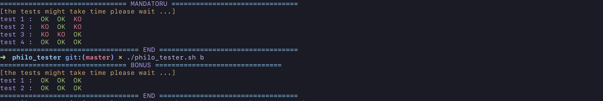

# tester for 42 project (philosopher) 
this tester check if your program work or not. 
>Note : this tester is wroted based on the new subject, philo and philo_bonus please respect the names of the directory and the binary files 
## How do i run this tester ?

<pre>git clone git@github.com:Yoo0lh/philosopher_tester.git   ./philo_tester.sh [mode]
</pre>
modes :
<pre>
m : mandatory
b : bonus 
</pre>

### example :
this example will run the mandatory part and the bonus part.
<pre>./philo_tester m
./philo_tester b</pre>

# Contribution
If you noticed something wrong with the code or if you'd like to see a new feature, you can submit an issue. If you'd like to contribute please submit a pull request. 

